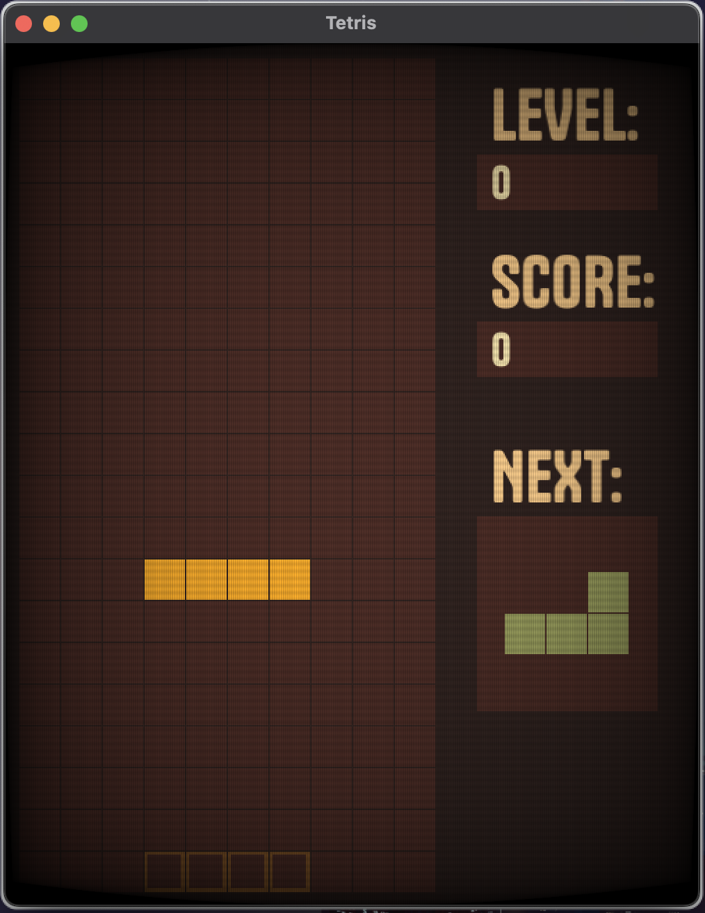

# Tetrs ✨

#### Dive into the classic world of Tetris with a modern touch!
Made with the power of 🦀 Rust, this remake offers a smooth and exciting puzzle experience. Whether you're a Tetris expert or a beginner, you'll find this hobby project at least a tad bit entertaining!





## Run Locally

Clone the project

```bash
  git clone https://github.com/codeaye/tetrs/
```

Go to the project directory

```bash
  cd tetrs
```

Install dependencies

```bash
  cargo install just
```

Build for your platform

```bash
  just build
```


## Acknowledgements

 - [Macroquad](https://macroquad.rs/)
 - [Macroquad Community](https://discord.gg/WfEp6ut)
 - [min-sized-rust](https://github.com/johnthagen/min-sized-rust)
 - [this random wikipedia page](https://en.wikipedia.org/wiki/Tetris_(NES_video_game))


## Documentation

- Left arrow -> Move Left
- Right arrow -> Move right
- Up arrow -> Rotate
- Down arrow -> Soft drop

## Color Reference

| Color             | Hex                                                                |
| ----------------- | ------------------------------------------------------------------ |
| EERIE_BLACK |  #202020|
| COCOA_BROWN |  #2d211e|
| CRATER_BROWN |  #452923|
| PICKLED_BEAN |  #6d3d29|
| BROWN |  #b16b4a|
| GOLD_SAND |  #e8be82|
| CLAY_CREEK |  #8e9257|
| RAVEN |  #707b88|
| CASCADE |  #8aa7ac|
| BURNT_SIENNA1 |  #e55d4d|
| BURNT_SIENNA2 |  #f1866c|
| FLAME_PEA |  #d26730|
| GOLDEN_GRASS |  #de9a28|
| ZOMBIE |  #e8d8a5|


## Appendix

uh so this is a hobby project so please do not expect any future updates, but if you find bugs please do report them, because solving them allows me to learn

